# Основы Алгоритмизации и программирования

Лекция 1: Алгоритмы и их свойства

<div class="pt-12">
  <span class="text-sm opacity-75">
    Преподаватель: Шалимов Владимир Алексеевич
  </span>
</div>

---

# О курсе

<div class="mt-8 space-y-6">

## 📋 Структура дисциплины

<div class="grid grid-cols-2 gap-8 mt-6">

<div class="border-l-4 border-blue-500 pl-4">

### Часть 1: Алгоритмы
- Основные понятия
- Свойства алгоритмов
- Способы записи
- Базовые структуры
- Сложность алгоритмов

</div>

<div class="border-l-4 border-green-500 pl-4">

### Часть 2: Python
- Основы языка
- Структуры данных
- Функции и модули
- ООП
- Практические задачи

</div>

</div>

<div class="mt-8 text-center text-lg">
✨ От теории к практике: алгоритмическое мышление + навыки программирования
</div>

</div>

---
layout: center
class: text-center
---

# Алгоритмы и их свойства

<div class="text-xl mt-4 opacity-75">
Основа программирования и вычислительного мышления
</div>

---

# Что такое алгоритм?

<div class="mt-8 space-y-6">


<div class="bg-blue-50 dark:bg-blue-900 p-6 rounded-lg text-lg">
<strong>Алгоритм</strong> — это точная конечная система правил, определяющая содержание и порядок действий исполнителя над некоторыми объектами для получения результата за конечное число шагов.
</div>

<div class="mt-8">

## 🎯 Простыми словами

Алгоритм — это **пошаговая инструкция** для решения задачи, которая приводит от исходных данных к желаемому результату.

</div>

<div class="mt-8 grid grid-cols-3 gap-4 text-center">
  <div class="p-4 bg-gray-100 dark:bg-gray-800 rounded">
    <div class="text-3xl mb-2">📥</div>
    <div class="font-bold">Вход</div>
    <div class="text-sm opacity-75">Исходные данные</div>
  </div>
  <div class="p-4 bg-gray-100 dark:bg-gray-800 rounded">
    <div class="text-3xl mb-2">⚙️</div>
    <div class="font-bold">Процесс</div>
    <div class="text-sm opacity-75">Последовательность шагов</div>
  </div>
  <div class="p-4 bg-gray-100 dark:bg-gray-800 rounded">
    <div class="text-3xl mb-2">📤</div>
    <div class="font-bold">Выход</div>
    <div class="text-sm opacity-75">Результат</div>
  </div>
</div>

</div>

---
layout: two-cols-header
---


# Примеры алгоритмов из жизни

::left::

### 🍳 Приготовление яичницы

1. Взять сковороду
2. Налить масло
3. Включить плиту
4. Разбить яйцо на сковороду
5. Жарить 3-5 минут
6. Выключить плиту

::right::

### 📞 Звонок по телефону

1. Взять телефон
2. Разблокировать экран
3. Открыть приложение "Телефон"
4. Набрать номер
5. Нажать кнопку вызова
6. Дождаться ответа


---

# Свойства алгоритмов

<div class="mt-6">

<!-- Любой алгоритм должен обладать следующими свойствами: -->

<div class="grid grid-cols-2 gap-2 mt-1">

<div class="border-2 border-blue-400 p-3 rounded-lg">
<h3 class="font-bold text-lg mb-1">Дискретность</h3>
<p class="text-sm">Алгоритм состоит из отдельных шагов. Каждое действие выполняется за конечное время.</p>
</div>

<div class="border-2 border-green-400 p-3 rounded-lg">
<h3 class="font-bold text-lg mb-1">Определённость</h3>
<p class="text-sm">Каждый шаг алгоритма должен быть точно и однозначно определён. Нет места двусмысленности.</p>
</div>

<div class="border-2 border-purple-400 p-3 rounded-lg">
<h3 class="font-bold text-lg mb-1">Результативность</h3>
<p class="text-sm">Алгоритм должен приводить к результату за конечное число шагов.</p>
</div>

<div class="border-2 border-red-400 p-3 rounded-lg">
<h3 class="font-bold text-lg mb-1">Массовость</h3>
<p class="text-sm">Алгоритм применим для решения целого класса задач, а не только для одного конкретного случая.</p>
</div>

<div class="border-2 border-orange-400 p-3 rounded-lg">
<h3 class="font-bold text-lg mb-1">Конечность</h3>
<p class="text-sm">Алгоритм должен завершаться после выполнения конечного числа шагов.</p>
</div>

<div class="border-2 border-teal-400 p-3 rounded-lg">
<h3 class="font-bold text-lg mb-1">Понятность</h3>
<p class="text-sm">Алгоритм должен быть понятен исполнителю, содержать только допустимые команды.</p>
</div>

</div>

</div>

---

# Свойство 1: Дискретность

<div class="mt-6">

<div class="bg-blue-50 dark:bg-blue-900 p-4 rounded-lg mb-6">
<strong>Дискретность</strong> — алгоритм разбит на отдельные элементарные шаги
</div>

### Пример: Алгоритм заваривания чая

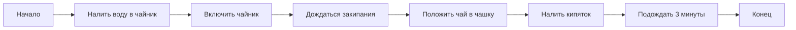

<div class="mt-4 text-lg opacity-75">
Каждый шаг — это отдельное законченное действие
</div>

</div>

---

# Свойство 2: Определённость (Детерминированность)

<div class="mt-6">

<div class="bg-green-50 dark:bg-green-900 p-4 rounded-lg mb-6">
<strong>Определённость</strong> — каждый шаг алгоритма понятен однозначно, не допускает разночтений
</div>

<div class="grid grid-cols-2 gap-6">

<div>

### ❌ Неопределённо

```text
1. Возьмите немного муки
2. Добавьте чуть-чуть воды
3. Замесите до нужной консистенции
4. Выпекайте некоторое время
```

<div class="text-sm text-red-600 dark:text-red-400 mt-2">
Слишком расплывчато! "Немного", "чуть-чуть", "некоторое время" — непонятно точно сколько.
</div>

</div>

<div>

### ✅ Определённо

```text
1. Возьмите 500 г муки
2. Добавьте 300 мл воды
3. Замесите тесто 5 минут
4. Выпекайте при 180°C в течение 30 минут
```

<div class="text-sm text-green-600 dark:text-green-400 mt-2">
Точные указания! Каждый шаг понятен и не вызывает вопросов.
</div>

</div>

</div>

</div>

---

# Свойство 3: Результативность

<div class="mt-6">

<div class="bg-purple-50 dark:bg-purple-900 p-4 rounded-lg mb-6">
<strong>Результативность</strong> — алгоритм должен завершиться и выдать результат за конечное число шагов
</div>

<div class="grid grid-cols-2 gap-6">

<div>

### ✅ Результативный алгоритм

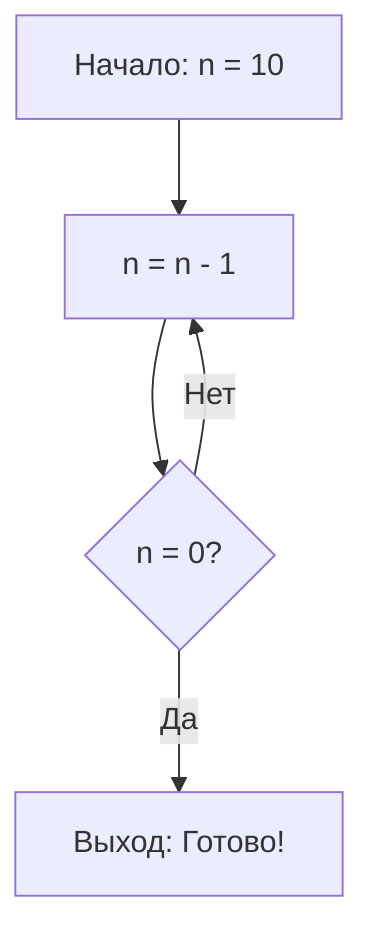

<div class="text-sm text-green-600 dark:text-green-400 mt-2">
Алгоритм завершится через 10 шагов
</div>

</div>

<div>

### ❌ Нерезультативный алгоритм

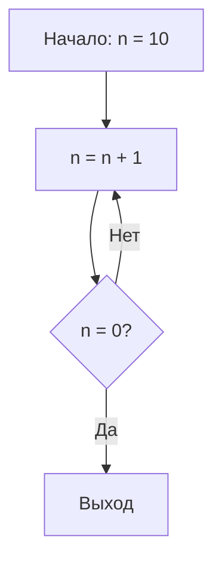

<div class="text-sm text-red-600 dark:text-red-400 mt-2">
Бесконечный цикл! n никогда не станет равным 0
</div>

</div>

</div>

</div>

---

# Свойство 4: Массовость

<div class="mt-6">

<div class="bg-red-50 dark:bg-red-900 p-4 rounded-lg mb-6">
<strong>Массовость</strong> — алгоритм применим к целому классу однотипных задач
</div>

## Пример: Алгоритм нахождения максимума

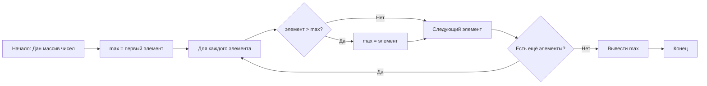

<div class="mt-4 grid grid-cols-3 gap-4 text-sm">
<div class="p-2 bg-gray-100 dark:bg-gray-800 rounded">
[3, 7, 2, 9, 1] → 9
</div>
<div class="p-2 bg-gray-100 dark:bg-gray-800 rounded">
[15, 8, 23, 4] → 23
</div>
<div class="p-2 bg-gray-100 dark:bg-gray-800 rounded">
[100, 50, 75] → 100
</div>
</div>

<div class="mt-2 text-sm opacity-75">
Один алгоритм работает для любого набора чисел!
</div>

</div>

---

# Задача 1: Определение алгоритма

<div class="mt-8">

<div class="bg-blue-50 dark:bg-blue-900 p-6 rounded-lg text-lg">

## Вопрос

Какие из следующих инструкций являются алгоритмами?

<div class="mt-6 space-y-4">

**A)** "Купи что-нибудь вкусное в магазине"

**B)** "Иди прямо 100 метров, поверни направо, пройди ещё 50 метров"

**C)** "Реши задачу как-нибудь"

**D)** "Повторяй: прибавь 1 к числу, пока оно не станет больше 100"

</div>

</div>


</div>

---
layout: two-cols-header
---

# Задача 1: Ответ

#### ✅ Правильный ответ: B и D

::left::

**A)** ❌ "Купи что-нибудь вкусное" — **не алгоритм**
- Нарушается свойство **определённости** (что именно вкусное?)
- Нет чёткой последовательности действий

**C)** ❌ "Реши задачу как-нибудь" — **не алгоритм**
- Полностью нарушается свойство **определённости**
- Нет конкретных шагов

::right::

**B)** ✅ "Иди прямо 100 метров..." — **алгоритм**
- Все шаги чётко определены
- Понятная последовательность действий

**D)** ✅ "Повторяй: прибавь 1..." — **алгоритм**
- Чёткая инструкция
- Определённое условие завершения
- Результативен (цикл закончится)


---

# Способы записи алгоритмов

<div class="mt-6">

## 📝 Основные формы представления

<div class="grid grid-cols-3 gap-4 mt-6">

<div class="border-2 border-blue-400 p-4 rounded-lg">
<div class="text-3xl mb-2 text-center">📄</div>
<h3 class="font-bold text-center mb-2">Словесная</h3>
<p class="text-sm">Описание на естественном языке</p>
<div class="mt-2 text-xs opacity-75">
Пример: "Возьми яблоко, вымой его, съешь"
</div>
</div>

<div class="border-2 border-green-400 p-4 rounded-lg">
<div class="text-3xl mb-2 text-center">📊</div>
<h3 class="font-bold text-center mb-2">Графическая</h3>
<p class="text-sm">Блок-схемы с символами</p>
<div class="mt-2 text-xs opacity-75">
Пример: Диаграммы с блоками и стрелками
</div>
</div>

<div class="border-2 border-purple-400 p-4 rounded-lg">
<div class="text-3xl mb-2 text-center">💻</div>
<h3 class="font-bold text-center mb-2">Программная</h3>
<p class="text-sm">Код на языке программирования</p>
<div class="mt-2 text-xs opacity-75">
Пример: Python, C++, Java
</div>
</div>

</div>

<div class="mt-8 p-4 bg-yellow-50 dark:bg-yellow-900 rounded-lg">
💡 <strong>На этом курсе</strong> мы будем использовать все три способа, но особое внимание уделим блок-схемам и программированию на Python
</div>

</div>

---

# Блок-схемы: Основные элементы

<div class="mt-4">

<div class="grid grid-cols-2 gap-6">

<div>

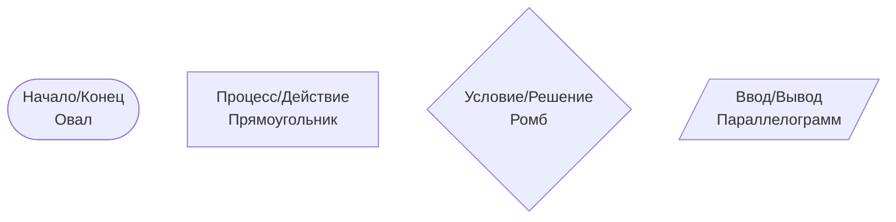

</div>

<div class="text-sm space-y-3">

### Обозначения:

**Овал** — начало или конец алгоритма

**Прямоугольник** — действие или операция

**Ромб** — проверка условия (развилка)

**Параллелограмм** — ввод или вывод данных

**Стрелки** — направление выполнения

</div>

</div>

<div class="mt-6 p-4 bg-blue-50 dark:bg-blue-900 rounded-lg">
<strong>Важно:</strong> Блок-схема должна читаться сверху вниз и слева направо. Каждый элемент соединяется стрелками, показывающими порядок выполнения.
</div>

</div>

---

# Пример: Алгоритм проверки числа на чётность


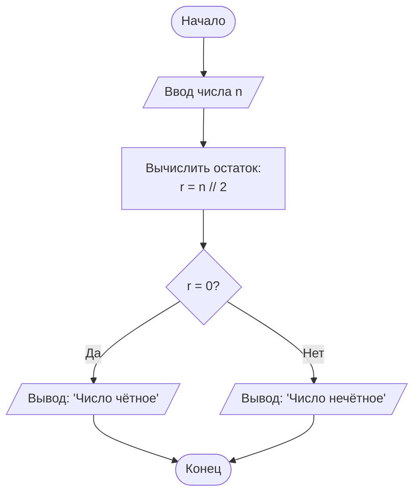

<div class="mt-1 grid grid-cols-2 gap-4 text-sm">

<div class="p-3 bg-gray-100 dark:bg-gray-800 rounded">
<strong>Пример 1:</strong> n = 8<br/>
8 // 2 = 0 → "Число чётное"
</div>

<div class="p-3 bg-gray-100 dark:bg-gray-800 rounded">
<strong>Пример 2:</strong> n = 7<br/>
7 // 2 = 1 → "Число нечётное"
</div>

</div>


---

# Задача 2: Анализ блок-схемы

<div class="mt-6">

<div class="bg-blue-50 dark:bg-blue-900 p-4 rounded-lg mb-4">
<strong>Вопрос:</strong> Что делает этот алгоритм? Какое значение будет выведено, если n = 5?
</div>

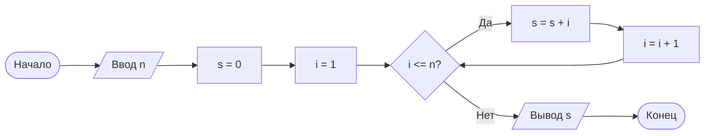
</div>

---

# Задача 2: Ответ

<div class="mt-0">

<div class="bg-green-50 dark:bg-green-900 px-4 py-2 rounded-lg">

**Алгоритм вычисляет сумму чисел от 1 до n**

### Пошаговое выполнение для n = 5:

<div class="mt-1 space-y-1 font-mono text-sm">

| Шаг | i | s | Условие i ≤ 5 |
|-----|---|---|---------------|
| 1 | 1 | 0 + 1 = 1 | ✓ Да |
| 2 | 2 | 1 + 2 = 3 | ✓ Да |
| 3 | 3 | 3 + 3 = 6 | ✓ Да |
| 4 | 4 | 6 + 4 = 10 | ✓ Да |
| 5 | 5 | 10 + 5 = 15 | ✓ Да |
| 6 | 6 | 15 | ✗ Нет → Выход |

</div>

### Результат: s = 15
</div>

</div>

---

# Типы алгоритмов: Линейные

<div class="mt-6">

<div class="bg-blue-50 dark:bg-blue-900 p-4 rounded-lg mb-4">
<strong>Линейный алгоритм</strong> — все команды выполняются последовательно, одна за другой
</div>

<div class="grid grid-cols-2 gap-6">

<div>

## Пример: Обмен значений

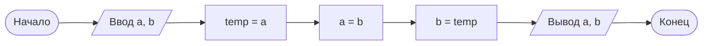

</div>


</div>

</div>

---

# Типы алгоритмов: Разветвляющиеся

<div class="mt-6">

<div class="bg-green-50 dark:bg-green-900 p-4 rounded-lg mb-4">
<strong>Разветвляющийся алгоритм</strong> — выполнение зависит от проверки условия
</div>

<div class="grid grid-cols-1 gap-6">

<div>

## Пример: Нахождение максимума

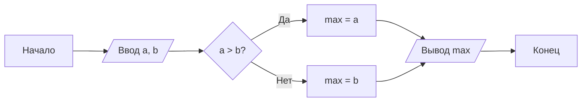

</div>
</div>
</div>

---

# Типы алгоритмов: Циклические

<div class="mt-6">

<div class="bg-purple-50 dark:bg-purple-900 p-4 rounded-lg mb-4">
<strong>Циклический алгоритм</strong> — содержит повторяющиеся действия (цикл)
</div>

## Пример: Вычисление факториала

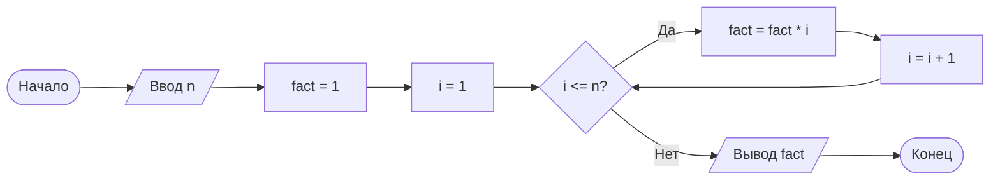

<div class="mt-4 text-sm">
<strong>Пример:</strong> n = 4 → fact = 1 × 1 × 2 × 3 × 4 = 24
</div>

</div>

---

# Задача 3: Составление блок-схемы

<div class="mt-8">

<div class="bg-blue-50 dark:bg-blue-900 p-6 rounded-lg text-lg">

## Задание

Составьте блок-схему алгоритма, который:

1. Принимает на вход число
2. Если число положительное — выводит его квадрат
3. Если число отрицательное — выводит его модуль (абсолютное значение)
4. Если число равно нулю — выводит "Ноль"

### Примеры работы:

- Вход: 5 → Выход: 25
- Вход: -3 → Выход: 3
- Вход: 0 → Выход: "Ноль"

</div>

</div>

---

# Задача 3: Решение

<div class="mt-6">

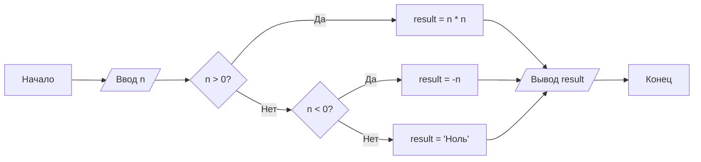

<div class="mt-4 grid grid-cols-3 gap-3 text-sm">
<div class="p-3 bg-gray-100 dark:bg-gray-800 rounded">
<strong>n = 5:</strong><br/>
5 > 0? → Да<br/>
result = 5 × 5 = 25
</div>
<div class="p-3 bg-gray-100 dark:bg-gray-800 rounded">
<strong>n = -3:</strong><br/>
-3 > 0? → Нет<br/>
-3 < 0? → Да<br/>
result = 3
</div>
<div class="p-3 bg-gray-100 dark:bg-gray-800 rounded">
<strong>n = 0:</strong><br/>
0 > 0? → Нет<br/>
0 < 0? → Нет<br/>
result = "Ноль"
</div>
</div>

</div>

---

### Практические рекомендации

<div class="mt-6">

<div class="space-y-4 mt-6">

<div class="border-l-4 border-blue-500 pl-4 p-3 bg-blue-50 dark:bg-blue-900">
<strong>1. Понимание задачи</strong><br/>
<span class="text-sm">Чётко определите входные данные и ожидаемый результат</span>
</div>

<div class="border-l-4 border-green-500 pl-4 p-3 bg-green-50 dark:bg-green-900">
<strong>2. Разбиение на шаги</strong><br/>
<span class="text-sm">Разделите сложную задачу на простые подзадачи</span>
</div>

<div class="border-l-4 border-purple-500 pl-4 p-3 bg-purple-50 dark:bg-purple-900">
<strong>3. Проверка свойств</strong><br/>
<span class="text-sm">Убедитесь, что алгоритм обладает всеми необходимыми свойствами</span>
</div>

<div class="border-l-4 border-orange-500 pl-4 p-3 bg-orange-50 dark:bg-orange-900">
<strong>4. Тестирование</strong><br/>
<span class="text-sm">Проверьте алгоритм на разных примерах, включая граничные случаи</span>
</div>

<div class="border-l-4 border-red-500 pl-4 p-3 bg-red-50 dark:bg-red-900">
<strong>5. Оптимизация</strong><br/>
<span class="text-sm">Подумайте, можно ли сделать алгоритм быстрее или проще</span>
</div>

</div>

</div>

---

# Резюме лекции

<div class="mt-6">

## 📚 Что мы изучили сегодня:

<div class="grid grid-cols-2 gap-6 mt-6">

<div>

### Теория

- ✅ Определение алгоритма
- ✅ 6 свойств алгоритмов:
  - Дискретность
  - Определённость
  - Результативность
  - Массовость
  - Конечность
  - Понятность
- ✅ Способы записи алгоритмов
- ✅ Элементы блок-схем

</div>

<div>

### Практика

- ✅ Типы алгоритмов:
  - Линейные
  - Разветвляющиеся
  - Циклические
- ✅ Анализ готовых алгоритмов
- ✅ Составление блок-схем

</div>

</div>
</div>

---

# Домашнее задание

<div class="mt-6">

<div class="space-y-6">

<div class="border-2 border-blue-400 p-4 rounded-lg">
<h3 class="font-bold text-lg mb-3">📝 Задание 1</h3>
<p>Составьте блок-схему алгоритма нахождения наибольшего общего делителя (НОД) двух чисел методом Евклида.</p>
</div>

<div class="border-2 border-purple-400 p-4 rounded-lg">
<h3 class="font-bold text-lg mb-3">📝 Задание 2</h3>
<p>Составьте блок-схему алгоритма, который определяет, является ли введённое число простым (делится только на 1 и на само себя).</p>
</div>

</div>

<div class="mt-6 p-4 bg-yellow-50 dark:bg-yellow-900 rounded-lg text-center">
📅 <strong>Срок сдачи:</strong> К следующему занятию<br/>
</div>

</div>

---
layout: center
class: text-center
---

# Спасибо за внимание!

